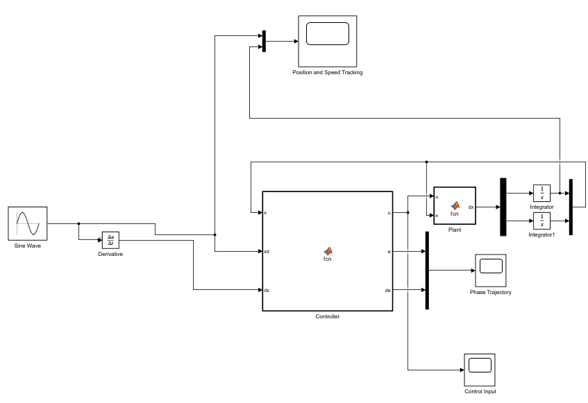

# 🚗 Sliding Mode Controller (SMC) with Reaching Law – MATLAB & Simulink Implementation

This project implements a **Sliding Mode Controller (SMC)** based on the reaching law method, as described in the referenced research paper. The system is tested using both **MATLAB (ODE solver)** and **Simulink**, and tracking performance, phase trajectory, and control input behavior are compared.

---

## 📁 Files

| File | Description |
|------|-------------|
| `smc_simulation.m` | MATLAB script implementing the SMC using `ode45` |
| `SMC_Reaching_Law.slx` | Simulink model of the same controller |
| `figures/` | Sample result plots from both MATLAB and Simulink |

---

##  Features

- Implements **reaching law-based SMC**
- Supports constant disturbance rejection
- Shows:
  - Position & speed tracking
  - Phase trajectory (state-space behavior)
  - Control input response

---

## Simulation Results

### MATLAB

- Solved using `ode45` (variable-step)
- High precision in early-stage response
- Clear convergence to reference

### Simulink

- Fixed-step or variable-step simulation
- Results may show slight difference due to solver type and block-level execution

---

## MATLAB vs Simulink – Why Different?

> Simulink and MATLAB can yield slightly different results due to **initial step handling, sign(s) processing**, and **solver behavior**.  
> **Overall convergence and control performance remain equivalent and reliable.**

---

## Reference

> *Design of Sliding Mode Controller based on Reaching Law*  
> [Insert full citation from your PDF paper here]

---

## Author Note

This repo was built for educational and verification purposes.  
Feel free to use, modify, or extend the implementation.

---
## 🖼 Example Result Plots

### SMC_Reaching_law
!{SMC](figures/SMC_Reaching_law.png)

### Simulink model

### Position and Speed Tracking

### Phase Trajectory

### Control Input

